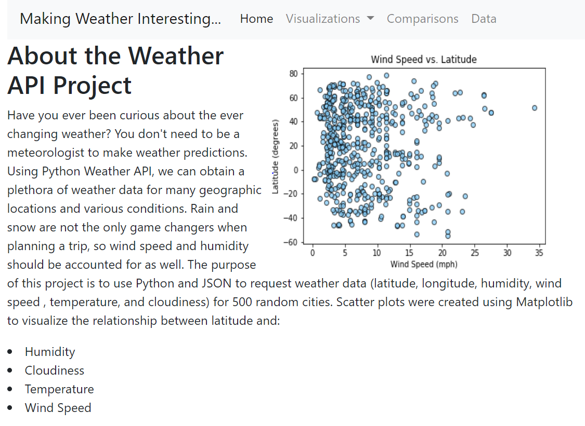

## KristiBischoff.github.io/weather_it = my first website!

This repository is a demo of HTML, CSS, and bootstrap grid for a website that holds previous project visualizations. A responsive dropdown navigation (menu) bar was coded for ease of viewing the various analyses and the ability to go back and forth to any page desired. Each visualization will have its own page with a summary in addition to a comparison page with all 4 visualizations on one page. Additionally, all 4 visualizations are displayed on the home page. The purpose of this is to demonstrate a great use for bootstrap grid in website development.

The data visualizations displayed are from the weather API project (using Pandas and Matplotlib.) 

Link to navigate the weather API website: https://kristibischoff.github.io/weather_it.html

## Screenshot of the website:

